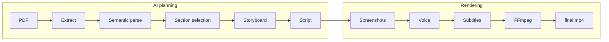

# content-gen

Turn a research PDF into a short vertical video. The pipeline reads the document, uses Gemini to plan what to show and say, then renders inspectable media assets into a finished MP4.

Videos are formatted for mobile (1080×1920). Gemini decides section count, scene count, shot count, and pacing (total duration, title-page length, scene durations) per document.

## How it works

The workflow has two phases: **AI planning** (Gemini) and **rendering** (deterministic, no LLM).



| Phase | Steps | What happens |
|-------|-------|--------------|
| Planning | Extract → Parse → Section selection → Storyboard → Script | PyMuPDF extracts text and layout. Gemini picks the most important sections, plans scenes and camera shots, then writes narration. |
| Rendering | Screenshots → Voice → Subtitles → Video assembly | Crops PDF regions per shot, synthesizes speech, burns karaoke captions, and stitches clips with FFmpeg. |

Every rendering step writes files to disk. You can regenerate subtitles without redoing voice, or re-run FFmpeg without repeating the expensive AI stages.

## Camera planning

Content scenes are not limited to a single screenshot. Gemini returns a `shots` array for each scene—one entry per on-screen frame—with:

- **visual** — detected figure or table label (e.g. `"Figure 3"`, `"Table 1"`) for diagram/table shots
- **page**, **paragraph**, and **framing** — for text shots (`wide`, `focus`, or `highlight`)
- **duration_seconds** — how long that frame stays on screen
- **goal** — what the viewer should notice

During semantic parsing, figures and tables are detected with bounding boxes and stable labels. The storyboard prompt lists every detected visual so Gemini can reference `"visual": "Figure 3"` instead of guessing crop coordinates.

The camera planner resolves each shot into a PDF crop region—either from a visual label or from paragraph framing. Shots within a scene are concatenated during FFmpeg assembly, so a scene might open wide on text, cut to a figure, then show a results table—all driven by the LLM plan.

## Timeline

Relative shot durations are compiled into absolute timelines after storyboard generation.

Each scene gets a `timeline` with segments like:

| Time | Segment |
|------|---------|
| 0–3s | Hook (wide shot) |
| 3–6s | Zoom (focus shot) |
| 6–8s | Highlight |

The full video `timeline` stacks scene segments and inserts transition markers at scene boundaries. Every shot stores `start_seconds` and `end_seconds` relative to its scene, and rendering reads per-shot durations from the timeline instead of inferring them ad hoc.

A title-page scene is prepended automatically (full first page, ~4 seconds). A closing takeaway scene is appended automatically (~4 seconds). Only middle content scenes require LLM-planned shots.

## Output layout

Assets for each run live under `output/{document_id}/`:

```
output/{document_id}/
  storyboard.json          # scenes, shots, timelines, crops, durations
  screenshots/
    scene01_shot01.png     # one PNG per camera shot
    scene01_shot02.png
  audio/
    scene01.wav            # one narration track per scene
  subtitles/
    scene01.ass            # karaoke ASS subtitles per scene
  clips/
    scene01.mp4            # assembled scene clip (shots + audio + subs)
  {document_id}.mp4        # final video
```

`storyboard.json` is the source of truth for what was planned. Inspect it to debug framing, timing, or section choices before re-rendering.

## Requirements

- Python 3.11+
- [FFmpeg](https://ffmpeg.org/) on your `PATH` (or set `FFMPEG_PATH`)
- A [Google Gemini API key](https://ai.google.dev/) (LLM stages and optional TTS)

## Quick start

```bash
make install
cp .env.example .env   # add your GEMINI_API_KEY
make check-gemini
make run PDF=path/to/paper.pdf
```

Or run the CLI directly:

```bash
.venv/bin/python -m app.main path/to/paper.pdf
.venv/bin/python -m app.main path/to/paper.pdf --project-id my-run
```

The command prints a JSON summary of the final `RenderResult` to stdout.

## Configuration

Copy `.env.example` to `.env` and adjust as needed. Environment variable names map to the settings below.

### LLM and safety ceilings

Gemini decides how many sections to include, how many scenes and shots to plan, and the target video duration. Optional env vars cap runaway responses only:

| Variable | Default | Description |
|----------|---------|-------------|
| `GEMINI_API_KEY` | — | Google Gemini API key |
| `GEMINI_MODEL` | `gemini-2.0-flash` | Model for section selection, storyboard, and script |
| `MAX_SECTIONS` | `15` | Safety ceiling on sections returned by the LLM |
| `MAX_STORYBOARD_SCENES` | `20` | Safety ceiling on content scenes |
| `MAX_SHOTS_PER_SCENE` | `8` | Safety ceiling on camera shots per scene |
| `MAX_VIDEO_DURATION_SECONDS` | `120` | Hard ceiling when fitting final video duration |

The storyboard LLM returns a `plan` object (`target_video_duration_seconds`, `title_page_duration_seconds`, `closing_scene_duration_seconds`, `min_scene_duration_seconds`) stored in `storyboard.json`.

### Voice and narration

| Variable | Default | Description |
|----------|---------|-------------|
| `VOICE_SYNTHESIZER` | `gemini` | Voice backend: `gemini` or `silent` |
| `TTS_MODEL` | `gemini-2.5-flash-preview-tts` | Gemini TTS model |
| `TTS_VOICE` | `Kore` | Prebuilt Gemini voice name |
| `TTS_SAMPLE_RATE` | `24000` | Output WAV sample rate |
| `TTS_FIT_SCENE_DURATION` | `true` | Speed up narration when TTS exceeds scene budget |
| `TTS_MAX_TEMPO` | `1.35` | Max speed-up when fitting scene duration |
| `WORDS_PER_MINUTE` | `150` | Speaking rate for duration estimates |
| `NARRATION_SPEED` | `1.0` | Playback speed multiplier |

### Screenshots and video

| Variable | Default | Description |
|----------|---------|-------------|
| `OUTPUT_DIR` | `output` | Root directory for rendered assets |
| `VIDEO_WIDTH` / `VIDEO_HEIGHT` | `1080` / `1920` | Vertical video dimensions |
| `VIDEO_FPS` | `30` | Output frame rate |
| `SCREENSHOT_DPI` | `300` | DPI for PDF page crops |
| `SCREENSHOT_PADDING` | `24` | Extra margin around crop regions (PDF points) |
| `SCREENSHOT_EXPAND_FACTOR` | `2.0` | Widen crops for more page context |
| `SCREENSHOT_MOBILE_CROP` | `true` | Fit crops to 9:16 aspect ratio |
| `PAGE_IMAGE_DPI` | `150` | DPI for intermediate page renders |
| `CAMERA_MOTION` | `static` | Per-shot motion: `static`, `zoom`, `pan`, `ken_burns`, `highlight` |
| `SCENE_TRANSITION` | `cut` | Between-scene transition: `cut` (audio-synced) or `crossfade` |
| `SCENE_TRANSITION_DURATION` | `0.5` | Crossfade length when using `crossfade` |
| `SUBTITLE_FONT_SIZE` | `72` | ASS subtitle font size |
| `FFMPEG_PATH` | `ffmpeg` | Path to the FFmpeg binary |

### Workflow and logging

| Variable | Default | Description |
|----------|---------|-------------|
| `MAX_RETRIES` | `3` | Retries per pipeline stage |
| `RETRY_DELAY_SECONDS` | `1.0` | Delay between retries |
| `LOG_LEVEL` | `INFO` | Log verbosity |
| `LOG_JSON` | `false` | Emit structured JSON logs |

## Pipeline stages

| Stage | Input | Output |
|-------|-------|--------|
| Document extraction | PDF path | Structured document with page images |
| Semantic parsing | Document | Typed blocks (headings, paragraphs, figures) |
| Content planning | Document | Top sections selected by Gemini |
| Storyboard generation | Content plan | Scene goals, LLM-planned shots, crops, durations |
| Script generation | Storyboard | Voice narration and overlay text |
| Screenshot generation | Script plan | Cropped PNG per shot |
| Voice generation | Render project | WAV narration per scene |
| Subtitle generation | Render project | ASS karaoke subtitles per scene |
| Video rendering | Render project | Scene clips and final MP4 |

Stages are orchestrated by `PipelineCoordinator` with validation, structured logging, and retries.

## Development

```bash
make lint       # ruff check + format
make test       # pytest
make test-cov   # pytest with 100% coverage requirement
```

## Project structure

```
app/
  agents/          # Gemini client
  models/          # Pydantic data contracts
  prompts/         # LLM prompt templates
  render/          # Screenshots, voice, subtitles, FFmpeg assembly
  services/        # Business logic, camera planning, pipeline stages
  workflows/       # Stage interface and coordinator
tests/             # Unit and integration tests
```
